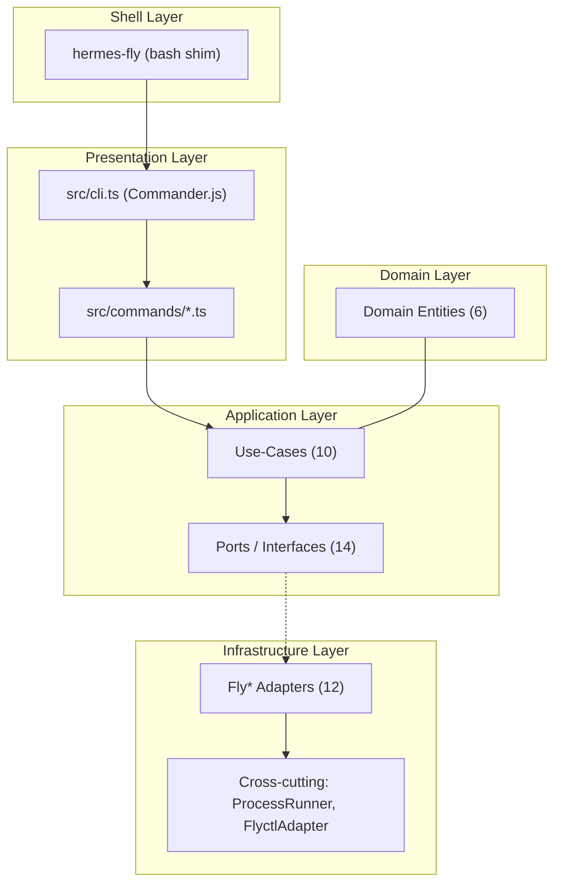

# hermes-fly Architecture Overview

Master navigation document for the hermes-fly Project Structure Files (PSF).

## 1. Project Identity

| Field | Value |
|-------|-------|
| **Name** | hermes-fly |
| **Version** | 0.1.20 (`src/version.ts`) |
| **Language** | TypeScript (ES2022, ESM) with Bash shim entry point |
| **Runtime** | Node.js via Commander.js v12.1.0 |
| **Architecture** | Domain-Driven Design (DDD) with Ports & Adapters |
| **Purpose** | Interactive CLI wizard to deploy Hermes Agent to Fly.io |
| **Source lines** | ~2,570 TypeScript across 57 source files |
| **Test lines** | ~2,987 TypeScript + ~22,570 BATS (parity + legacy) |

## 2. Quick Navigation

| PSF | Scope | Key Files |
|-----|-------|-----------|
| [01 CLI Entry & Dispatch](01-cli-entry-and-dispatch.md) | Shell shim, Commander.js setup, command routing | `hermes-fly`, `src/cli.ts`, `src/commands/` |
| [02 Deploy Context](02-deploy-bounded-context.md) | Deploy wizard, provisioning, resume, templates | `src/contexts/deploy/` |
| [03 Runtime Context](03-runtime-bounded-context.md) | List, status, logs commands and adapters | `src/contexts/runtime/` |
| [04 Diagnostics, Release & Messaging](04-diagnostics-release-messaging.md) | Doctor, destroy, Telegram setup | `src/contexts/diagnostics/`, `release/`, `messaging/` |
| [05 Testing & QA](05-testing-and-qa.md) | Dual test strategy, parity harness, CI | `tests-ts/`, `tests/` |
| [06 Cross-cutting Infrastructure](06-cross-cutting-infrastructure.md) | Process runner, flyctl adapter, config, legacy bridge | `src/adapters/`, `src/legacy/` |
| [07 Deployment Pipeline](07-deployment.md) | 6-phase deploy flow, templates, Fly.io provisioning | `templates/`, deploy adapters |
| [08 Maintainability](08-maintainability.md) | DDD conventions, dependency-cruiser, extension patterns | `dependency-cruiser.cjs`, `tsconfig.json` |
| [09 Security](09-security.md) | Secret handling, container isolation, input validation | `templates/entrypoint.sh` |

## 3. Architecture Overview



## 4. Bounded Contexts

Five DDD bounded contexts under `src/contexts/`:

| Context | Domain Entities | Use-Cases | Ports | Adapters |
|---------|----------------|-----------|-------|----------|
| **deploy** | DeploymentIntent, DeploymentPlan, ProvenanceRecord | RunDeployWizard, ProvisionDeployment, ResolveTargetApp, ResumeDeploymentChecks | 5 | 5 |
| **runtime** | (minimal) | ListDeployments, ShowStatus, ShowLogs | 4 | 4 |
| **diagnostics** | DriftFinding | RunDoctor | 2 | 1 |
| **release** | ReleaseContract | DestroyDeployment | 2 | 1 |
| **messaging** | MessagingPolicy | (inline) | 1 | 1 |

## 5. Dependency Flow

```
Commands (presentation) --> Use-Cases (application) --> Ports (contracts)
                                                          |
                                                    Adapters (infrastructure)
                                                          |
                                              ProcessRunner / flyctl CLI
```

**Enforced by** `dependency-cruiser.cjs`:
- Domain must not import infrastructure or presentation
- Domain must not import legacy
- Only `bash-bridge.ts` and `process.ts` may import `node:child_process`

## 6. Build Toolchain

| Tool | Purpose | Config |
|------|---------|--------|
| `tsc` | TypeScript compilation | `tsconfig.json` (ES2022, NodeNext, strict) |
| `tsx` | Test runner (Node.js native `--test`) | Used via `npm run test:*` |
| `dependency-cruiser` | Architecture boundary enforcement | `dependency-cruiser.cjs` |
| Commander.js v12.1.0 | CLI argument parsing | `package.json` |

## 7. Legacy Context

- Bash modules archived in `lib/archive/` (14 files, preserved for reference)
- `src/legacy/bash-bridge.ts` defines `BashFallbackSignal` (exit code 90)
- Legacy bridge contracts defined but not integrated into dispatch
- BATS test suite maintained for parity verification against TypeScript

## 8. Key Metrics

| Metric | Value |
|--------|-------|
| TypeScript source files | 57 |
| TypeScript test files | 16 |
| BATS test files | 32 (project) |
| Total TS test cases | ~150 |
| Total BATS test cases | ~862 |
| DDD bounded contexts | 5 |
| Port interfaces | 14 |
| Infrastructure adapters | 12 |
| Domain entities | 6 |
| Use-cases | 10 |
| CLI commands | 9 (deploy, resume, list, status, logs, doctor, destroy, help, version) |

## 9. Reading Order

1. **Start here** (this document) for orientation
2. [01 CLI Entry](01-cli-entry-and-dispatch.md) to understand command flow
3. [02 Deploy Context](02-deploy-bounded-context.md) for the core business logic
4. [06 Cross-cutting](06-cross-cutting-infrastructure.md) for shared adapters
5. Remaining PSFs as needed by task
