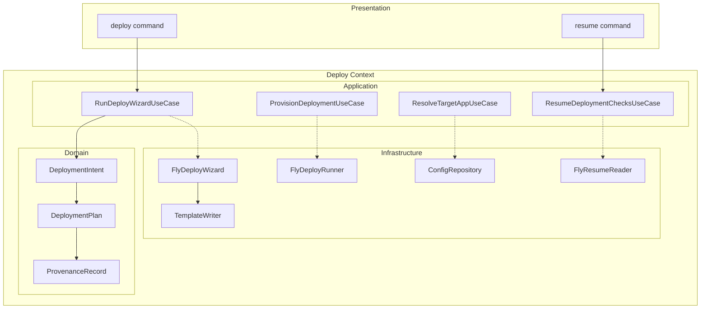

# Deploy Bounded Context

PSF for the deploy bounded context — the core business logic for deploying Hermes Agent to Fly.io.

**Related PSFs**: [00-architecture](00-hermes-fly-architecture-overview.md) | [01-cli-dispatch](01-cli-entry-and-dispatch.md) | [07-deployment-pipeline](07-deployment.md) | [06-infrastructure](06-cross-cutting-infrastructure.md)

## 1. TL;DR

- Largest bounded context: 3 domain entities, 4 use-cases, 5 ports, 5 adapters
- Located at `src/contexts/deploy/`
- Orchestrates the full deploy wizard: preflight → config → build → provision → deploy → post-deploy
- Immutable domain entities with factory `create()` methods and validation
- All external I/O behind port interfaces for testability

## 2. Context Diagram

## 3. Domain Layer

`src/contexts/deploy/domain/` — 3 immutable entities:

### DeploymentIntent (`deployment-intent.ts`, 78 lines)
Immutable command object capturing what the user wants to deploy:
- Fields: `appName`, `region`, `vmSize`, `provider`, `model`, `channel`
- Factory: `DeploymentIntent.create(fields)` with validation (non-empty strings)
- Validation: rejects empty/whitespace strings for required fields

### DeploymentPlan (`deployment-plan.ts`, 58 lines)
Extends intent with build-time details:
- Additional fields: `hermesAgentRef`, `compatPolicyVersion`, `createdAtIso`
- Factory: `DeploymentPlan.fromIntent(intent, ref, policy, timestamp)`
- Validation: stable channel requires pinned (non-"main") ref

### ProvenanceRecord (`provenance-record.ts`, 88 lines)
Audit trail for completed deployments:
- Fields: versions (hermes-fly, hermes-agent), provider, model, timestamp, channel
- Factory: `ProvenanceRecord.fromPlan(plan, cliVersion)`
- Used for post-deploy metadata tracking

## 4. Application Layer (Use-Cases)

### RunDeployWizardUseCase (`run-deploy-wizard.ts`, 88 lines)
Primary orchestrator for the 6-phase deploy flow:
1. Checks platform compatibility
2. Validates prerequisites (flyctl installed, authenticated)
3. Collects deployment configuration via interactive prompts
4. Generates build context (Dockerfile, fly.toml, entrypoint.sh)
5. Provisions resources (app, volume, secrets)
6. Runs deployment and post-deploy verification

Depends on: `DeployWizardPort`

### ProvisionDeploymentUseCase (`provision-deployment.ts`, 50 lines)
Executes infrastructure provisioning:
- Creates Fly.io app
- Creates persistent volume
- Sets secrets (API keys, Telegram tokens)
- Handles retry on transient failures

Depends on: `DeployRunnerPort`

### ResolveTargetAppUseCase (`resolve-target-app.ts`, 36 lines)
Resolves which app to target:
- Priority: explicit `-a` flag > `config.yaml:current_app` > null

Depends on: `ConfigRepositoryPort`

### ResumeDeploymentChecksUseCase (`resume-deployment-checks.ts`, 38 lines)
Re-runs post-deploy verification for interrupted deploys:
- Checks machine state, health endpoint, saves to config

Depends on: `ResumeChecksPort`

## 5. Port Interfaces

`src/contexts/deploy/application/ports/` — 5 contracts:

| Port | Methods | Purpose |
|------|---------|---------|
| `DeployWizardPort` (24 lines) | checkPlatform, checkPrereqs, collectConfig, generateBuildContext, provision, deploy, postDeploy | Full wizard orchestration |
| `DeployRunnerPort` (5 lines) | createApp, createVolume, setSecrets | Low-level Fly.io operations |
| `ConfigRepositoryPort` (3 lines) | readCurrentApp | Config file access |
| `DeploymentPlanWriterPort` (5 lines) | writePlan | Persist deployment plans |
| `ResumeChecksPort` (5 lines) | fetchStatus, checkMachine, saveApp | Post-deploy verification |

## 6. Infrastructure Adapters

`src/contexts/deploy/infrastructure/`

### FlyDeployWizard (`adapters/fly-deploy-wizard.ts`, 167 lines)
Largest adapter — implements `DeployWizardPort`:
- Runs 6 preflight checks via fly CLI
- Collects 7 config values via interactive prompts
- Delegates build context generation to TemplateWriter
- Delegates provisioning to FlyDeployRunner
- Runs `fly deploy` with timeout

### FlyDeployRunner (`adapters/fly-deploy-runner.ts`, 46 lines)
Implements `DeployRunnerPort`:
- `fly apps create`, `fly volumes create`, `fly secrets set`
- Uses `ProcessRunner` for all external calls

### TemplateWriter (`adapters/template-writer.ts`, 30 lines)
Implements `DeploymentPlanWriterPort`:
- Generates Dockerfile, fly.toml, entrypoint.sh from templates
- Uses sed-style substitution on template files in `templates/`

### FlyResumeReader (`adapters/fly-resume-reader.ts`, 65 lines)
Implements `ResumeChecksPort`:
- Fetches app status via fly CLI
- Checks machine state
- Updates config.yaml with app tracking

### ConfigRepository (`config-repository.ts`, 10 lines)
Implements `ConfigRepositoryPort`:
- Reads `current_app` from `~/.hermes-fly/config.yaml`
- Minimal implementation — config parsing is straightforward

## 7. Testing

Tests in `tests-ts/deploy/`:

| Test File | Cases | Coverage |
|-----------|-------|----------|
| `run-deploy-wizard.test.ts` (273 lines) | Wizard orchestration, phase failures, early exits | Use-case logic |
| `provision-deployment.test.ts` (89 lines) | Provisioning steps, retry behavior | Use-case logic |
| `resolve-target-app.test.ts` (50 lines) | -a flag, config fallback, null cases | Use-case logic |
| `resume-deployment-checks.test.ts` (76 lines) | Resume flow, state checks | Use-case logic |

All tests mock ports (not implementations) and inject via constructor.
