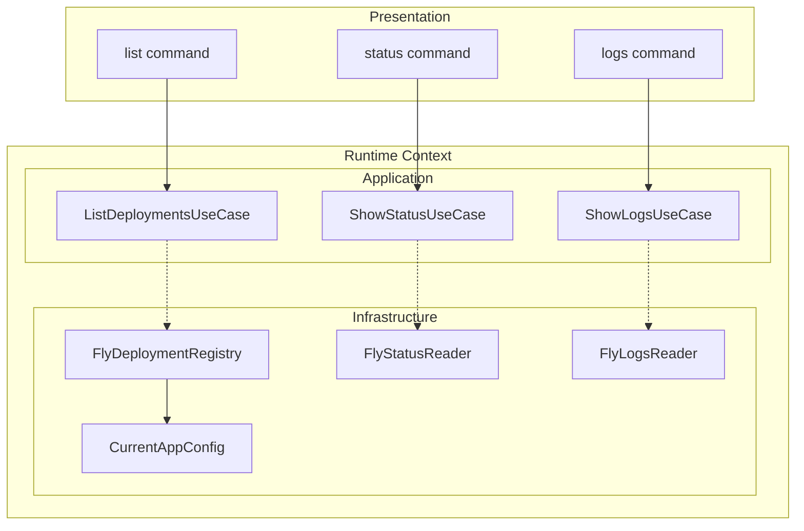

# Runtime Bounded Context

PSF for the runtime bounded context — list, status, and logs commands for managing deployed agents.

**Related PSFs**: [00-architecture](00-hermes-fly-architecture-overview.md) | [01-cli-dispatch](01-cli-entry-and-dispatch.md) | [06-infrastructure](06-cross-cutting-infrastructure.md)

## 1. TL;DR

- Handles read-only operations on deployed agents: list, status, logs
- Located at `src/contexts/runtime/`
- 3 use-cases, 4 ports, 4 adapters (+ 1 reserved legacy port)
- Largest adapter: `FlyDeploymentRegistry` (190 lines) — multi-source config + Fly CLI parsing
- Streaming support for real-time logs

## 2. Context Diagram



## 3. Use-Cases

### ListDeploymentsUseCase (`list-deployments.ts`, 24 lines)
Lists all tracked deployments:
- Reads deployment registry
- Returns `DeploymentListRow[]` or empty state message
- Always exits 0 (no failure mode)

### ShowStatusUseCase (`show-status.ts`, 9 lines)
Thin delegator to StatusReaderPort:
- Returns `StatusReadResult` (ok with fields, or error with message)
- Exit 0 on success, 1 on error

### ShowLogsUseCase (`show-logs.ts`, 13 lines)
Delegator with streaming support:
- `getLogs(appName)` for one-shot retrieval
- `streamLogs(appName, options)` for real-time tailing
- Exit 0 on success, 1 on error

## 4. Port Interfaces

`src/contexts/runtime/application/ports/`

| Port | Key Methods | Lines |
|------|-------------|-------|
| `DeploymentRegistryPort` (10 lines) | `listDeployments()` → `DeploymentListRow[]` | Typed row: appName, region, platform, machineState |
| `StatusReaderPort` (15 lines) | `getStatus(appName)` → `StatusReadResult` | Result: `{ ok: true, fields }` or `{ ok: false, error }` |
| `LogsReaderPort` (15 lines) | `getLogs(appName)`, `streamLogs(appName, opts)` | Streaming via callback options |
| `LegacyCommandRunnerPort` (8 lines) | `invoke(invocation)` → `LegacyCommandResult` | Reserved for bash-bridge fallback (not yet integrated) |

## 5. Infrastructure Adapters

### FlyDeploymentRegistry (`fly-deployment-registry.ts`, 190 lines)
Most complex runtime adapter:
- Reads `~/.hermes-fly/config.yaml` to discover tracked apps
- Calls `fly status --json` for each app to get machine state
- Parses JSON with defensive null handling (handles both `machines` and `Machines` keys)
- Deduplicates entries, normalizes region/platform data
- Saves updated app list back to config

### FlyStatusReader (`fly-status-reader.ts`, 25 lines)
- Parses `fly status --json` into structured `StatusReadResult`
- Extracts: app name, hostname, deploy status, machine state, image info
- Returns error result on parse failure or non-zero exit

### FlyLogsReader (`fly-logs-reader.ts`, 17 lines)
- `getLogs`: wraps `fly logs` → `ProcessResult`
- `streamLogs`: wraps `fly logs` with streaming callbacks via `ProcessRunner.runStreaming()`

### CurrentAppConfig (`current-app-config.ts`, 37 lines)
- `readCurrentApp(configDir?)` — reads `current_app` from config.yaml
- Returns `string | null`
- Handles missing file/dir gracefully

## 6. Data Types

```typescript
interface DeploymentListRow {
  appName: string;
  region: string;
  platform: string;
  machineState: string | null;
}

type StatusReadResult =
  | { ok: true; appName: string; hostname: string; deployStatus: string; ... }
  | { ok: false; error: string };
```

## 7. Testing

Tests in `tests-ts/runtime/`:

| Test File | Lines | Coverage |
|-----------|-------|----------|
| `list-deployments.test.ts` | 272 | Registry parsing, dedup, empty state |
| `show-status.test.ts` | 626 | Status parsing, JSON edge cases, error handling |
| `show-logs.test.ts` | 469 | One-shot + streaming, error cases |
| `cli-root-contracts.test.ts` | 113 | Commander.js program behavior |
| `resolve-app-parity.test.ts` | 129 | -a flag parsing matches bash behavior |
| `deploy-command.test.ts` | 133 | Deploy command arg handling |
| `doctor-command.test.ts` | 102 | Doctor command integration |
| `destroy-command.test.ts` | 107 | Destroy command with --force |
| `resume-command.test.ts` | 88 | Resume command flow |

The runtime context has the most extensive test coverage (~1,939 lines of tests) due to complex JSON parsing and parity requirements with the bash implementation.
