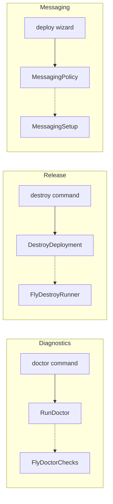

# Diagnostics, Release, and Messaging Contexts

PSF for the three smaller bounded contexts: diagnostics (doctor), release (destroy), and messaging (Telegram).

**Related PSFs**: [00-architecture](00-hermes-fly-architecture-overview.md) | [01-cli-dispatch](01-cli-entry-and-dispatch.md) | [06-infrastructure](06-cross-cutting-infrastructure.md)

## 1. TL;DR

- Three focused bounded contexts with minimal domain logic
- **Diagnostics**: 8 health checks via `RunDoctorUseCase` (116 lines)
- **Release**: destroy workflow with confirmation and cleanup (36 lines use-case)
- **Messaging**: Telegram-only setup with policy domain (44 lines)
- All follow strict DDD layering: domain → application (use-cases, ports) → infrastructure (adapters)

## 2. Diagnostics Context

`src/contexts/diagnostics/`

### Domain

**DriftFinding** (`domain/drift-finding.ts`, 62 lines):
- Represents a detected configuration drift or health issue
- Used by doctor checks to report findings

### Use-Case

**RunDoctorUseCase** (`application/use-cases/run-doctor.ts`, 116 lines):
- Runs 8 sequential health checks
- Early-exits if app not found (remaining checks depend on app existence)
- Returns overall pass/fail with individual check results

### Port

**DoctorChecksPort** (`application/ports/doctor-checks.port.ts`, 10 lines):
8 diagnostic methods:

| Check | What It Verifies |
|-------|-----------------|
| `appExists` | Fly.io app is registered |
| `machineRunning` | At least one machine is in running state |
| `volumesMounted` | Persistent volumes attached |
| `secretsSet` | Required secrets configured |
| `hermesProcess` | Hermes Agent process is running inside container |
| `gatewayHealth` | HTTP gateway responds |
| `apiConnectivity` | External API endpoints reachable |
| `drift` | Configuration matches expected state |

### Adapter

**FlyDoctorChecks** (`infrastructure/adapters/fly-doctor-checks.ts`, 127 lines):
- Implements all 8 checks via fly CLI + HTTP probes
- Uses `ProcessRunner` for CLI calls
- HTTP health checks with timeout handling

### Testing

| Test File | Lines |
|-----------|-------|
| `tests-ts/diagnostics/run-doctor.test.ts` | 93 |
| `tests-ts/runtime/doctor-command.test.ts` | 102 |

## 3. Release Context

`src/contexts/release/`

### Domain

**ReleaseContract** (`domain/release-contract.ts`, 38 lines):
- Validates that git tag (e.g., `v0.1.20`) matches `HERMES_FLY_TS_VERSION` (`0.1.20`)
- Used by CI/release pipeline for consistency checks

### Use-Case

**DestroyDeploymentUseCase** (`application/use-cases/destroy-deployment.ts`, 36 lines):
- Orchestrates teardown: confirm → destroy app → cleanup volumes → Telegram logout → remove config
- Supports `--force` to skip confirmation
- Returns exit code 4 if app not found

### Ports

| Port | Methods |
|------|---------|
| `DestroyRunnerPort` (6 lines) | destroyApp, cleanupVolumes, telegramLogout, removeConfig |
| `ReleaseContractCheckerPort` (5 lines) | checkContract |

### Adapter

**FlyDestroyRunner** (`infrastructure/adapters/fly-destroy-runner.ts`, 90 lines):
- `fly apps destroy --yes` for app removal
- Best-effort Telegram logout via `fly ssh console` (non-blocking)
- Removes app entry from `~/.hermes-fly/config.yaml`
- Catches and handles "app not found" errors gracefully

### Testing

| Test File | Lines |
|-----------|-------|
| `tests-ts/release/destroy-deployment.test.ts` | 105 |
| `tests-ts/runtime/destroy-command.test.ts` | 107 |

## 4. Messaging Context

`src/contexts/messaging/`

### Domain

**MessagingPolicy** (`domain/messaging-policy.ts`, 44 lines):
- Encodes messaging platform rules (Telegram-only since v0.1.14)
- Discord wizard removed; secrets still bridged for backward compat in entrypoint.sh

### Port

**MessagingPolicyRepositoryPort** (`application/ports/messaging-policy-repository.port.ts`, 6 lines):
- `readPolicy()` → MessagingPolicy

### Adapter

**MessagingSetup** (`infrastructure/adapters/messaging-setup.ts`, 10 lines):
- Configures Telegram bot token and chat ID during deploy wizard
- Minimal adapter — most messaging logic delegated to Hermes Agent container

## 5. Context Relationships

## 6. Exit Codes

| Context | Code | Meaning |
|---------|------|---------|
| Diagnostics | 0 | All checks pass |
| Diagnostics | 1 | One or more checks failed |
| Release | 0 | App destroyed successfully |
| Release | 1 | Destroy failed |
| Release | 4 | App not found |
