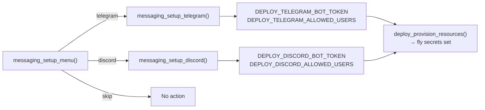

# UI, Configuration, and Messaging

PSF for the shared UI primitives, local configuration management, and messaging platform setup.

**Related PSFs**: [00-architecture](00-hermes-fly-architecture-overview.md) | [07-deployment](07-deployment.md) | [03-operations](03-infrastructure-and-operations.md)

## 1. Scope

Three foundational modules used by the rest of the system:

| Path | Lines | Role |
|------|-------|------|
| `lib/ui.sh` | ~224 | Colors, prompts, spinners, logging, exit codes |
| `lib/config.sh` | ~191 | App tracking via `~/.hermes-fly/config.yaml` |
| `lib/messaging.sh` | ~181 | Telegram/Discord setup wizards |

## 2. UI Module (`lib/ui.sh`)

### 2.1 Exit Code Constants

Defined as `readonly` and exported. Re-sourcing `ui.sh` after these are set would be fatal (readonly violation), which is why all modules guard against re-sourcing.

| Constant | Value | Meaning |
|----------|-------|---------|
| `EXIT_SUCCESS` | 0 | All operations succeeded |
| `EXIT_ERROR` | 1 | General error |
| `EXIT_AUTH` | 2 | Authentication failure |
| `EXIT_NETWORK` | 3 | Network connectivity failure |
| `EXIT_RESOURCE` | 4 | Resource not found / limit |

### 2.2 Color System

`ui_color_enabled()` returns true when:
- `NO_COLOR` environment variable is not set to `"1"` (respects [no-color.org](https://no-color.org/) standard)
- stdout is a terminal (`[[ -t 1 ]]`)

ANSI color codes used:

| Color | Code | Used by |
|-------|------|---------|
| Blue | `34` | `ui_info` |
| Green | `32` | `ui_success` |
| Yellow | `33` | `ui_warn` |
| Red | `31` | `ui_error` |
| Cyan | `36` | `ui_step`, spinner |

`ui_error` writes to stderr (`>&2`). All other output functions write to stdout.

### 2.3 Output Functions

| Function | Prefix | Destination |
|----------|--------|-------------|
| `ui_info "msg"` | `[info]` | stdout |
| `ui_success "msg"` | `✓` | stdout |
| `ui_warn "msg"` | `[warn]` | stdout |
| `ui_error "msg"` | `[error]` | stderr |
| `ui_step N TOTAL "msg"` | `[N/TOTAL]` | stdout |

### 2.4 Interactive Prompts

| Function | Behavior |
|----------|----------|
| `ui_ask "prompt" VARNAME` | Read line into variable, prompt on stderr |
| `ui_ask_secret "prompt" VARNAME` | Same but with `read -rs` (no echo) |
| `ui_confirm "prompt"` | `[y/N]` prompt, returns 0 for y/yes, 1 otherwise |
| `ui_select "prompt" VARNAME options...` | Numbered menu, stores selected option |
| `ui_banner "title"` | Box-drawing characters: `╔═══╗ ║ title ║ ╚═══╝` |

`ui_select` uses `eval` to set the caller's variable — a common Bash pattern for returning values from functions. Input validation ensures the choice number is within range.

### 2.5 Spinner System

Animated braille spinner for long-running operations. Three functions:

**`ui_spinner_start "msg"`**:
- Creates temp file for dynamic message updates
- Spawns background subshell with `trap 'exit 0' TERM HUP`
- Cycles through 10 braille frames: `⠋ ⠙ ⠹ ⠸ ⠼ ⠴ ⠦ ⠧ ⠇ ⠏`
- 80ms between frames
- Uses `disown` to prevent job control messages
- Degrades gracefully on non-interactive terminals (no animation)

**`ui_spinner_update "new_msg"`**:
- Writes new message to temp file
- Spinner subshell reads file each frame

**`ui_spinner_stop RC "msg"`**:
- Kills spinner process (`kill` + `wait`)
- Removes temp file
- Prints `✓ msg` (green, rc=0) or `✗ msg` (red, rc!=0)

### 2.6 Logging

File-based logging for debugging:

| Function | Output |
|----------|--------|
| `log_init()` | Creates log directory + empty log file |
| `log_info "msg"` | `YYYY-MM-DD HH:MM:SS [INFO] msg` |
| `log_error "msg"` | `YYYY-MM-DD HH:MM:SS [ERROR] msg` |

Log path: `${HERMES_FLY_LOG_DIR:-.}/hermes-fly.log`

## 3. Configuration Module (`lib/config.sh`)

### 3.1 Config File Format

Location: `${HERMES_FLY_CONFIG_DIR:-$HOME/.hermes-fly}/config.yaml`

```yaml
current_app: hermes-alex-042
apps:
  - name: hermes-alex-042
    region: iad
    deployed_at: 2025-01-15T10:30:00Z
  - name: hermes-staging-001
    region: fra
    deployed_at: 2025-01-10T08:00:00Z
```

Not a full YAML parser — uses line-oriented grep/sed operations on this simple structure.

### 3.2 Functions

| Function | Purpose |
|----------|---------|
| `config_init()` | Create config dir + file if missing |
| `config_save_app "name" "region"` | Add/update app entry, set as current_app |
| `config_get_current_app()` | Echo current_app value (validated) |
| `config_list_apps()` | Echo all app names, one per line |
| `config_remove_app "name"` | Remove app entry; clear current_app if it matched |
| `config_resolve_app "$@"` | Parse `-a APP` from args, or fallback to current_app |

### 3.3 Input Validation

`config_get_current_app` validates the stored value against `^[a-zA-Z0-9._-]+$` before returning it. This prevents path traversal or command injection from a corrupted config file.

`config_list_apps` applies the same validation per-line.

### 3.4 Save/Remove Mechanics

**`config_save_app`**:
1. Updates `current_app:` line via sed (or inserts at top if missing)
2. Removes existing app entry if present (prevents duplicates)
3. Ensures `apps:` header exists
4. Appends 3-line block: `- name:`, `region:`, `deployed_at:`

**`_remove_app_entry`** (internal):
- `sed -i.bak "/^  - name: ${name}$/,+2d"` — deletes 3-line block
- Removes `.bak` file after sed

**`config_remove_app`**:
1. Calls `_remove_app_entry`
2. If removed app was `current_app`, clears the value

### 3.5 App Resolution

`config_resolve_app "$@"`:

```text
1. Parse args for -a APP → echo APP, return 0
2. Read config_get_current_app → echo value, return 0
3. echo "", return 1
```

This is the primary resolution mechanism used by `status`, `logs`, `doctor`, and `destroy` commands.

## 4. Messaging Module (`lib/messaging.sh`)

### 4.1 Validation Functions

| Function | Rules | Returns |
|----------|-------|---------|
| `messaging_validate_telegram_token` | Matches `^[0-9]+:[A-Za-z0-9_-]+$` | 0/1 |
| `messaging_validate_discord_token` | Non-empty, >= 20 characters | 0/1 |
| `messaging_validate_user_ids` | Empty OR comma-separated numeric IDs | 0/1 |

Validation is advisory — warnings are printed but invalid tokens are accepted. This avoids blocking deployments when token formats change.

### 4.2 Setup Menu

`messaging_setup_menu()`:
- ASCII table with 3 options: Telegram, Discord, Skip (default)
- Echoes `"telegram"`, `"discord"`, or `"skip"` to stdout
- Default is Skip (option 3) — messaging is optional

### 4.3 Telegram Setup

`messaging_setup_telegram()`:
1. Prints instructions for creating bot via @BotFather
2. Prompts for bot token (secret input)
3. Validates token format (warns on invalid)
4. Prints instructions for finding user ID via @userinfobot
5. Prompts for allowed user IDs (comma-separated, blank = all)
6. Validates user IDs (warns on non-numeric)
7. Exports `DEPLOY_TELEGRAM_BOT_TOKEN` and `DEPLOY_TELEGRAM_ALLOWED_USERS`

### 4.4 Discord Setup

`messaging_setup_discord()`:
1. Prints instructions for Discord Developer Portal
2. Prompts for bot token (secret input)
3. Validates token format (warns on invalid)
4. Prints instructions for finding user ID (Developer Mode)
5. Prompts for allowed user IDs
6. Validates user IDs
7. Exports `DEPLOY_DISCORD_BOT_TOKEN` and `DEPLOY_DISCORD_ALLOWED_USERS`

### 4.5 Data Flow



## 5. Module Guard Pattern

All three modules (and all `lib/*.sh` files) use the same guard against direct execution:

```bash
if [[ "${BASH_SOURCE[0]}" == "${0}" ]]; then
  echo "Error: source this file, do not execute directly." >&2
  exit 1
fi
```

Additionally, modules that depend on other modules check for already-defined symbols before sourcing:

```bash
# ui.sh defines EXIT_SUCCESS as readonly — re-sourcing would be fatal
if [[ -z "${EXIT_SUCCESS+x}" ]]; then
  source "${_SCRIPT_DIR}/ui.sh" 2>/dev/null || true
fi

# Check if a function from the dependency is defined
if ! declare -f fly_check_installed >/dev/null 2>&1; then
  source "${_SCRIPT_DIR}/fly-helpers.sh" 2>/dev/null || true
fi
```

This allows modules to be sourced individually for testing while preventing double-sourcing in production.
