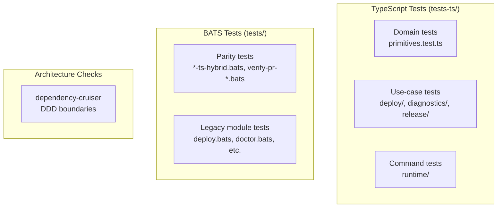

# Testing and Quality Assurance

PSF for the dual test strategy, parity verification, and quality tooling.

**Related PSFs**: [00-architecture](00-hermes-fly-architecture-overview.md) | [08-maintainability](08-maintainability.md) | [02-deploy](02-deploy-bounded-context.md)

## 1. TL;DR

- **Dual test strategy**: TypeScript tests (Node.js native runner) + BATS tests (parity + legacy)
- **TypeScript**: 16 test files, ~150 cases, ~2,987 lines in `tests-ts/`
- **BATS**: 32 project test files, ~862 cases in `tests/`
- **Parity harness**: Verifies TypeScript CLI output matches original bash behavior
- **Architecture enforcement**: dependency-cruiser validates DDD boundary rules

## 2. Test Architecture



## 3. TypeScript Test Suite

**Framework**: Node.js native test runner (`node:test` + `node:assert/strict`)
**Runner**: `tsx --test` (via npm scripts)

### Test Organization

```
tests-ts/
├── domain/
│   └── primitives.test.ts          # Domain entity validation (262 lines)
├── deploy/
│   ├── run-deploy-wizard.test.ts   # Wizard orchestration (273 lines)
│   ├── provision-deployment.test.ts # Provisioning steps (89 lines)
│   ├── resolve-target-app.test.ts  # App resolution (50 lines)
│   └── resume-deployment-checks.test.ts # Resume flow (76 lines)
├── diagnostics/
│   └── run-doctor.test.ts          # Doctor checks (93 lines)
├── release/
│   └── destroy-deployment.test.ts  # Destroy flow (105 lines)
└── runtime/
    ├── cli-root-contracts.test.ts  # Commander.js program (113 lines)
    ├── deploy-command.test.ts      # Deploy arg handling (133 lines)
    ├── destroy-command.test.ts     # Destroy with --force (107 lines)
    ├── doctor-command.test.ts      # Doctor integration (102 lines)
    ├── list-deployments.test.ts    # Registry parsing (272 lines)
    ├── resolve-app-parity.test.ts  # -a flag parity (129 lines)
    ├── resume-command.test.ts      # Resume command (88 lines)
    ├── show-logs.test.ts           # Logs + streaming (469 lines)
    └── show-status.test.ts         # Status parsing (626 lines)
```

### Testing Patterns

**1. Port Mocking** — mock the interface, not the implementation:
```typescript
const port: DeployWizardPort = {
  checkPlatform: async () => ({ ok: true }),
  checkPrereqs: async () => ({ ok: true }),
  // ... remaining methods
};
const uc = new RunDeployWizardUseCase(port);
```

**2. Adapter Testing** — mock ProcessRunner, verify CLI invocation:
```typescript
const runner: ProcessRunner = {
  run: async () => ({ stdout: jsonFixture, stderr: "", exitCode: 0 }),
};
const adapter = new FlyctlAdapter(runner);
```

**3. Command Testing** — inject dependencies, verify exit codes + output:
```typescript
const lines: string[] = [];
const code = await runStatusCommand(["-a", "test-app"], {
  useCase: mockUseCase,
  stderr: { write: (s: string) => lines.push(s) },
});
assert.strictEqual(code, 0);
```

**4. Temp Directory Isolation** — for file I/O tests:
```typescript
const root = await mkdtemp(join(tmpdir(), "hermes-"));
try { /* test with real files */ }
finally { await rm(root, { recursive: true }); }
```

## 4. BATS Test Suite

**Framework**: BATS (Bash Automated Testing System), vendored in `tests/bats/`
**Helpers**: `tests/test_helper/` (bats-support, bats-assert)

### Key Test Files

| File | Tests | Purpose |
|------|-------|---------|
| `deploy.bats` | ~134 | Deploy wizard (legacy bash) |
| `prereqs.bats` | ~76 | Prerequisite detection |
| `prereqs_edge_cases.bats` | ~57 | Prereqs edge cases |
| `hybrid-dispatch.bats` | ~60 | TS/bash hybrid dispatch |
| `doctor.bats` | ~50 | Doctor checks (legacy) |
| `reasoning.bats` | ~45 | Reasoning module |
| `openrouter.bats` | ~40 | OpenRouter API |
| `list-ts-hybrid.bats` | ~15 | List command parity |
| `status-ts-hybrid.bats` | ~10 | Status command parity |
| `logs-ts-hybrid.bats` | ~10 | Logs command parity |

### Parity Testing

Parity tests ensure TypeScript commands produce identical output to bash:

**Snapshot-based** (`tests/parity/`):
- `scripts/parity-capture.sh` — captures bash CLI outputs as baseline snapshots
- `scripts/parity-compare.sh` — diffs candidate (TS) output against baseline
- Snapshots stored in `tests/parity/baseline/` (exit codes, stdout, stderr)

**Verifier-based** (`tests/verify-pr-*.bats`):
- `verify-pr-d1-list-command.bats` — validates list command parity
- `verify-pr-d1-report-content.bats` — validates report content
- `verify-pr-d2-status-logs.bats` — validates status + logs parity
- `verify-pr-full-commander.bats` — validates full Commander.js transition

## 5. Architecture Enforcement

**dependency-cruiser** (`dependency-cruiser.cjs`):

Forbidden dependency patterns:
1. `domain/` must not import from `infrastructure/` or `presentation/`
2. `domain/` must not import from `legacy/`
3. Only `bash-bridge.ts` and `process.ts` may import `node:child_process`

Run: `npm run arch:ddd-boundaries`

## 6. Running Tests

```bash
# TypeScript tests (individual)
npm run test:domain-primitives
npm run test:runtime-list
npm run test:deploy-resolve-target-app

# BATS tests
./tests/bats/bin/bats tests/deploy.bats
./tests/bats/bin/bats tests/

# Architecture check
npm run arch:ddd-boundaries

# Parity check
npm run parity:check
```

## 7. Quality Metrics

| Metric | Value |
|--------|-------|
| TypeScript test files | 16 |
| TypeScript test cases | ~150 |
| TypeScript test lines | ~2,987 |
| BATS project test files | 32 |
| BATS test cases | ~862 |
| Strict mode | `tsconfig.json: strict: true` |
| Architecture rules | 3 forbidden patterns (dependency-cruiser) |
