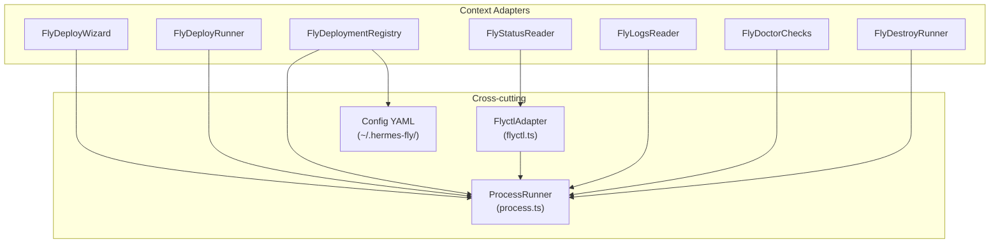

# Cross-cutting Infrastructure

PSF for shared adapters, process execution, Fly CLI wrapper, config management, and legacy bridge.

**Related PSFs**: [00-architecture](00-hermes-fly-architecture-overview.md) | [02-deploy](02-deploy-bounded-context.md) | [03-runtime](03-runtime-bounded-context.md)

## 1. TL;DR

- **ProcessRunner** (`src/adapters/process.ts`, 84 lines): sole gateway to `node:child_process`
- **FlyctlAdapter** (`src/adapters/flyctl.ts`, 146 lines): typed wrapper around `fly` CLI
- **Config**: `~/.hermes-fly/config.yaml` (app tracking, non-sensitive data only)
- **Legacy bridge** (`src/legacy/`, 28 lines): BashFallbackSignal contracts, not yet integrated

## 2. Process Runner

`src/adapters/process.ts` (84 lines)

### Interface
```typescript
interface ProcessRunner {
  run(command: string, args: string[], opts?): Promise<ProcessResult>;
  runStreaming(command: string, args: string[], callbacks): Promise<{ exitCode: number }>;
}

interface ProcessResult {
  stdout: string;
  stderr: string;
  exitCode: number;
}
```

### Implementation: NodeProcessRunner
- Only place in the codebase that imports `node:child_process` (enforced by dependency-cruiser)
- `run()`: spawns child process, collects stdout/stderr as strings, returns ProcessResult
- `runStreaming()`: streams stdout/stderr via callbacks for real-time output (used by logs)
- Supports `env` override for injecting environment variables
- All other adapters depend on this interface, never on child_process directly

### Testability
Every adapter that needs external commands receives a `ProcessRunner` via constructor injection. Tests provide mock implementations that return predetermined results.

## 3. Flyctl Adapter

`src/adapters/flyctl.ts` (146 lines)

### Interface
```typescript
interface FlyctlPort {
  getMachineState(appName: string): Promise<string | null>;
  getAppStatus(appName: string): Promise<AppStatusResult>;
  getAppLogs(appName: string): Promise<ProcessResult>;
  streamAppLogs(appName: string, options?): Promise<{ exitCode: number }>;
}
```

### Implementation: FlyctlAdapter
- Wraps common `fly` CLI patterns into typed methods
- **JSON parsing**: `fly status --json` with defensive handling:
  - Handles both `machines` (lowercase) and `Machines` (uppercase) keys
  - Returns null/error on parse failure (never throws)
- **Status result**: typed union: `{ ok: true, fields... }` | `{ ok: false, error }`
- **Machine state**: extracts first machine's state from status JSON

### Data Types
```typescript
type AppStatusResult =
  | { ok: true; appName: string; hostname: string; deployStatus: string;
      machineState: string; imageRef: string; createdAt: string }
  | { ok: false; error: string };
```

## 4. Configuration Management

Config file: `~/.hermes-fly/config.yaml`

### What's Stored
- `current_app`: name of the most recently deployed/selected app
- `apps`: list of tracked apps with region, platform, timestamps
- **No secrets** — only app names, regions, timestamps (see [09-security](09-security.md))

### Access Patterns
- **Read**: `CurrentAppConfig.readCurrentApp(configDir?)` in `src/contexts/runtime/infrastructure/adapters/current-app-config.ts` (37 lines)
- **Read**: `ConfigRepository.readCurrentApp()` in `src/contexts/deploy/infrastructure/config-repository.ts` (10 lines)
- **Write**: `FlyDeploymentRegistry.saveApp()` in `src/contexts/runtime/infrastructure/adapters/fly-deployment-registry.ts` (190 lines)
- **Delete**: `FlyDestroyRunner.removeConfig()` in `src/contexts/release/infrastructure/adapters/fly-destroy-runner.ts`

### Config Dir Override
All config access accepts an optional `configDir` parameter, defaulting to `~/.hermes-fly/`. Tests use temp directories to avoid touching the real config.

## 5. Legacy Bridge

`src/legacy/` (28 lines total)

### bash-bridge-contract.ts (17 lines)
```typescript
type LegacyFallbackReason = "ts_unavailable" | "fallback_signal" | "runtime_error";

interface LegacyCommandInvocation {
  command: string;
  args: string[];
  fallbackReason: LegacyFallbackReason;
}

interface LegacyCommandResult {
  exitCode: number;
  stdout: string;
  stderr: string;
}

interface LegacyBashBridge {
  invoke(invocation: LegacyCommandInvocation): Promise<LegacyCommandResult>;
}
```

### bash-bridge.ts (11 lines)
```typescript
class BashFallbackSignal extends Error {
  code = 90;
}
```

### Current State
- Contracts fully defined but **not integrated** into command dispatch
- `BashFallbackSignal` (exit code 90) provides a signal mechanism for future fallback
- Archived bash modules in `lib/archive/` (14 files) preserved for reference
- The `LegacyCommandRunnerPort` in the runtime context is reserved for this bridge

## 6. Dependency Diagram



## 7. Archived Bash Modules

`lib/archive/` contains the original 14 bash modules:
- config.sh, deploy.sh, destroy.sh, docker-helpers.sh, doctor.sh
- fly-helpers.sh, list.sh, logs.sh, messaging.sh, openrouter.sh
- prereqs.sh, reasoning.sh, status.sh, ui.sh

These are preserved for reference and parity testing but are no longer part of the active execution path.
