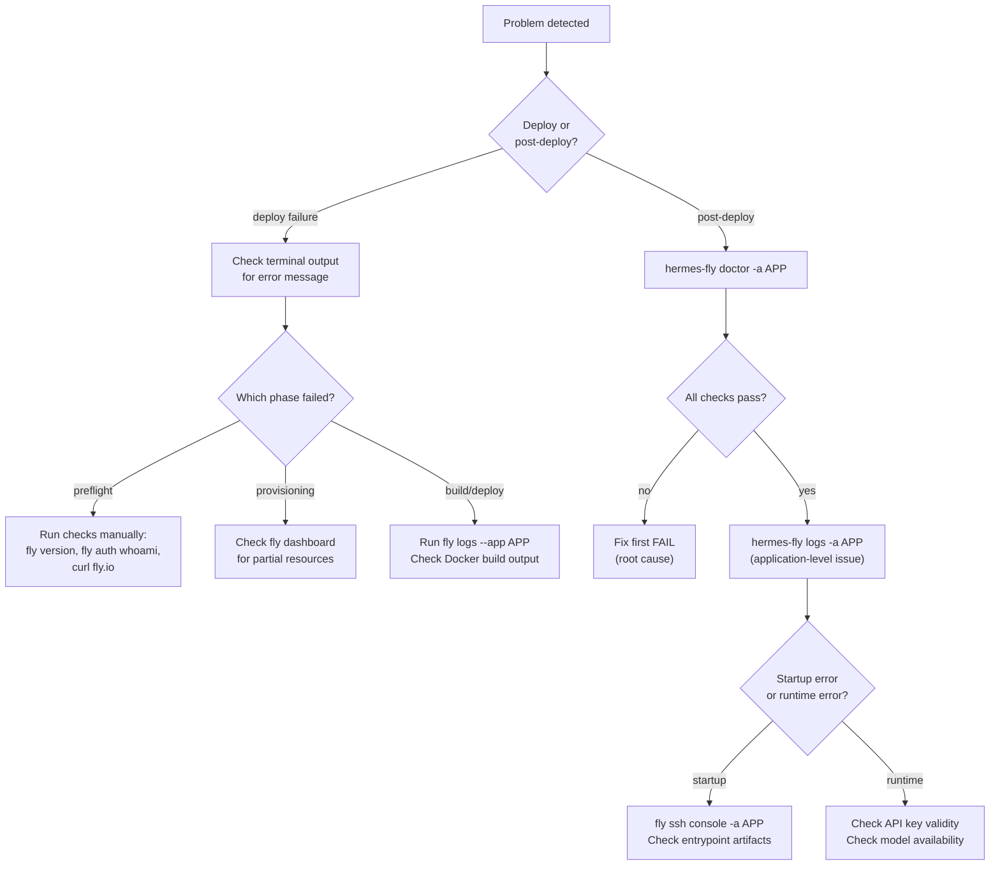

# Debugging

PSF for debugging strategies, diagnostic tools, log analysis, and common failure patterns.

**Related PSFs**: [00-architecture](00-hermes-fly-architecture-overview.md) | [03-operations](03-infrastructure-and-operations.md) | [05-testing](05-testing-and-qa.md) | [07-deployment](07-deployment.md)

## 1. Scope

This document covers how to debug hermes-fly itself (the CLI tool) and how to diagnose Hermes Agent deployment failures on Fly.io. It covers built-in diagnostics, log analysis, common failure patterns, and developer debugging techniques.

## 2. Built-in Diagnostics: `hermes-fly doctor`

The primary debugging tool. Runs 7 automated checks:

```bash
hermes-fly doctor              # Check current app
hermes-fly doctor -a my-app    # Check specific app
```

### Check Results Reference

| Check | PASS means | FAIL fix |
|-------|-----------|----------|
| **app** | App exists in Fly.io | Run `hermes-fly deploy` |
| **machine** | Machine state = started/running | `fly machine start -a APP` |
| **volumes** | At least one volume attached | `fly volumes create -a APP` |
| **secrets** | OPENROUTER_API_KEY or NOUS_API_KEY or LLM_API_KEY present | `fly secrets set OPENROUTER_API_KEY=xxx -a APP` |
| **hermes** | Hermes process detected in status JSON | Redeploy or check Dockerfile |
| **gateway** | `curl https://APP.fly.dev` responds within 10s | Check logs for startup errors |
| **api** | LLM provider endpoint reachable | Check API key validity, provider status |

### Interpreting Doctor Output

```text
[PASS] app: App 'my-hermes' found
[PASS] machine: Machine is running
[PASS] volumes: Volumes attached
[PASS] secrets: Required secrets are set
[FAIL] hermes: Hermes process not found in status    ← Problem here
[FAIL] gateway: Gateway not responding               ← Consequence
[PASS] api: LLM API is reachable
```

Read from top to bottom. The first FAIL is usually the root cause; subsequent FAILs are often consequences.

## 3. Log Analysis

### 3.1 CLI Logs

```bash
hermes-fly logs                # Stream live logs
hermes-fly logs -a my-app      # Specific app
```

This wraps `fly logs --app APP`. Additional flyctl flags can be passed through.

Useful flyctl log options (passed after app name):
- `fly logs --app APP --no-tail` — show recent logs without streaming
- `fly logs --app APP --region iad` — filter by region

### 3.2 Local Operation Log

Location: `${HERMES_FLY_LOG_DIR:-.}/hermes-fly.log`

Format: `YYYY-MM-DD HH:MM:SS [INFO|ERROR] message`

This log captures hermes-fly's own operations. Useful for debugging deploy failures when terminal output has scrolled away.

### 3.3 Container Startup Log

The entrypoint script (`templates/entrypoint.sh`) runs on every boot. If the container fails to start, check logs for:

| Log pattern | Meaning |
|-------------|---------|
| `ln -sfn: No such file or directory` | hermes-agent binary missing from /opt/hermes/ |
| `sed: can't read /root/.hermes/config.yaml` | Volume mount issue, config not seeded |
| `hermes gateway: command not found` | Hermes installation failed during build |
| Python traceback | Hermes Agent startup error (check API key, model config) |

## 4. Common Failure Patterns

### 4.1 Deploy Failures

| Symptom | Cause | Fix |
|---------|-------|-----|
| "fly CLI not found" | flyctl not installed | Install from fly.io/docs/flyctl/install/ |
| "fly version X is too old" | flyctl < 0.2.0 | `brew upgrade flyctl` or reinstall |
| "Not authenticated" | Fly.io session expired | `fly auth login` |
| "Cannot reach fly.io" | Network issue | Check internet, VPN, firewall |
| "App name not available" | Name taken globally | Try a more unique name |
| "Failed to create volume" | Region has no capacity | Try a different region |
| Deploy timeout | Slow Docker build or machine start | Increase `DEPLOY_TIMEOUT` |

### 4.2 Post-Deploy Issues

| Symptom | Cause | Fix |
|---------|-------|-----|
| App status "stopped" | Machine crashed or auto-stopped | `fly machine start -a APP` |
| Gateway not responding | Hermes not binding port 8080 | Check `hermes-fly logs` for startup errors |
| API errors in logs | Invalid API key or model ID | `fly secrets set OPENROUTER_API_KEY=new-key -a APP` |
| "Volume wipe" on redeploy | Binary paths overwritten by mount | Fixed in v0.1.7 — redeploy with latest |

### 4.3 Entrypoint Issues

The entrypoint performs critical setup on every boot. Common problems:

| Issue | Debug step |
|-------|------------|
| Symlinks broken | `fly ssh console -a APP` → `ls -la /root/.hermes/hermes-agent` |
| .env not bridged | `fly ssh console -a APP` → `cat /root/.hermes/.env` |
| config.yaml not patched | `fly ssh console -a APP` → `grep default /root/.hermes/config.yaml` |
| Rate limits not cleared | Check `/root/.hermes/pairing/_rate_limits.json` |

## 5. Developer Debugging Techniques

### 5.1 Verbose Mode

```bash
HERMES_FLY_VERBOSE=1 hermes-fly deploy
```

Switches from animated spinner to step-by-step numbered output. Easier to see where failures occur.

### 5.2 Tracing Bash Execution

```bash
bash -x hermes-fly deploy
```

Prints every command before execution. Very verbose but shows exact execution path.

For a specific module:

```bash
# Add to top of lib/deploy.sh temporarily
set -x
```

### 5.3 Inspecting Fly.io Resources Directly

```bash
# App status (raw JSON)
fly status --app APP --json

# Machine details
fly machine list --app APP --json

# Volume state
fly volumes list --app APP --json

# Secrets (names only, not values)
fly secrets list --app APP

# SSH into running container
fly ssh console --app APP

# View recent logs without streaming
fly logs --app APP --no-tail
```

### 5.4 Testing Individual Modules

Source a module in an interactive shell:

```bash
source lib/ui.sh
source lib/config.sh

# Now call functions directly
config_get_current_app
# → hermes-alex-042
```

### 5.5 Test-Mode Overrides

| Variable | Effect |
|----------|--------|
| `HERMES_FLY_RETRY_SLEEP=0` | No sleep in retry loops |
| `HERMES_FLY_PLATFORM=Linux` | Force platform detection |
| `HERMES_FLY_CONFIG_DIR=/tmp/test` | Isolated config |
| `NO_COLOR=1` | Disable colors for log-friendly output |

### 5.6 Debugging Template Generation

Inspect generated artifacts before deploy:

```bash
source lib/docker-helpers.sh

build_dir=$(docker_get_build_dir)
docker_generate_dockerfile "$build_dir" "main"
docker_generate_fly_toml "$build_dir" "test-app" "iad" "shared-cpu-1x" "256mb" "hermes_data" "1gb"
docker_generate_entrypoint "$build_dir"

# Inspect
cat "$build_dir/Dockerfile"
cat "$build_dir/fly.toml"
cat "$build_dir/entrypoint.sh"
```

## 6. Debugging Flowchart



## 7. Exit Code Reference

When hermes-fly exits non-zero, the exit code indicates the failure category:

| Code | Constant | Common causes |
|------|----------|---------------|
| 0 | `EXIT_SUCCESS` | Everything worked |
| 1 | `EXIT_ERROR` | Unsupported platform, missing tool, invalid input, deploy failure |
| 2 | `EXIT_AUTH` | Fly.io authentication expired or missing |
| 3 | `EXIT_NETWORK` | Cannot reach fly.io |
| 4 | `EXIT_RESOURCE` | App or resource not found (destroy of nonexistent app) |

## 8. Known Limitations

- **No structured logging**: CLI output mixes informational text with error messages. Redirect stderr to capture errors: `hermes-fly deploy 2>errors.log`
- **JSON parsing fragility**: The grep/sed JSON parsing can break on multi-line or deeply nested JSON. If doctor gives odd results, install `jq` for more reliable parsing.
- **No debug flag**: There's no `--debug` flag. Use `HERMES_FLY_VERBOSE=1` or `bash -x` instead.
- **Spinner hides errors**: The default spinner mode suppresses stderr from checks. Use verbose mode to see all error output.
