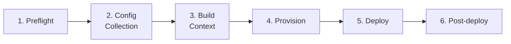
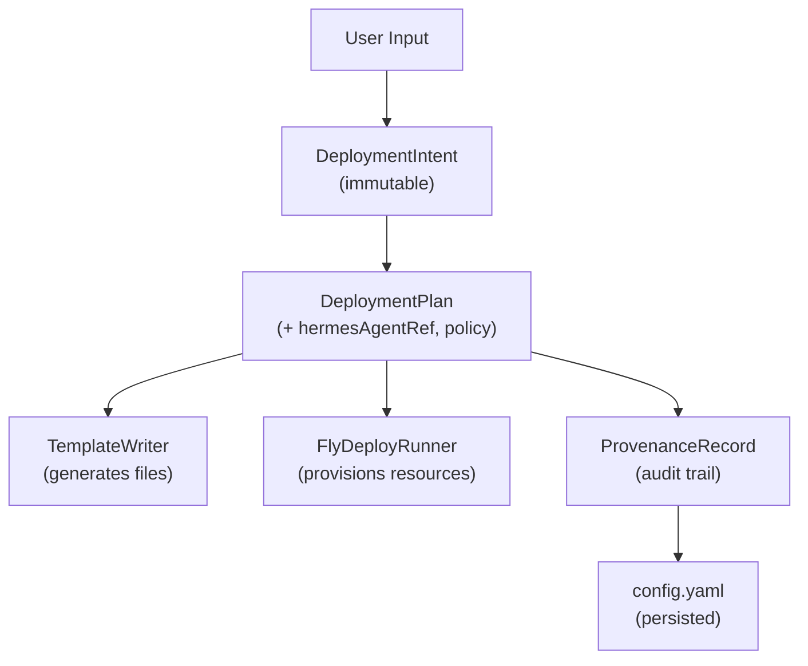

# Deployment Pipeline

PSF for the 6-phase deployment flow, template generation, and Fly.io resource provisioning.

**Related PSFs**: [00-architecture](00-hermes-fly-architecture-overview.md) | [02-deploy-context](02-deploy-bounded-context.md) | [09-security](09-security.md)

## 1. TL;DR

- 6-phase deploy pipeline: preflight → config → build context → provision → deploy → post-deploy
- Template system: Dockerfile, fly.toml, entrypoint.sh generated via sed substitution
- Resource provisioning: app creation, volume, secrets — all via fly CLI through adapters
- Orchestrated by `RunDeployWizardUseCase` delegating to `FlyDeployWizard` adapter

## 2. Pipeline Overview

## 3. Phase 1: Preflight

Checks via `FlyDeployWizard.checkPlatform()` and `checkPrereqs()`:

| Check | Method | Failure |
|-------|--------|---------|
| Platform support | OS detection | Exit with unsupported platform message |
| flyctl installed | `which fly` / PATH check | Offer install guidance |
| flyctl version | `fly version` parse | Warning if outdated |
| flyctl auth | `fly auth whoami` | Redirect to `fly auth login` |
| API connectivity | `fly orgs list` | Network error message |
| Docker available | `docker info` | Install guidance |

### Auto-Install
The `--no-auto-install` flag (deploy command option) skips automatic prerequisite installation. Without it, missing prereqs trigger guided installation.

## 4. Phase 2: Config Collection

Interactive prompts collect 7 configuration values:

| Config | Source | Default |
|--------|--------|---------|
| Organization | `fly orgs list` | First available |
| App name | User input | `hermes-<random>` |
| Region | `fly platform regions` | Nearest |
| VM size | Preset list | `shared-cpu-1x` |
| Volume size | User input | `1` GB |
| LLM provider + model | OpenRouter API / user selection | Varies |
| Messaging (Telegram) | Token + chat ID prompts | Optional |

Config values populate a `DeploymentIntent` domain entity (see [02-deploy](02-deploy-bounded-context.md)).

## 5. Phase 3: Build Context

`TemplateWriter` adapter generates deployment files from `templates/`:

### templates/Dockerfile.template
- Base: `python:3.11-slim`
- Installs: git, curl, xz-utils
- Clones Hermes Agent at specified ref (pinned for stable, "main" for edge)
- Installs Python dependencies
- Copies generated entrypoint.sh

### templates/fly.toml.template
- App name, region, VM size substituted
- Volume mount configuration
- `min_machines_running = 1`
- Health check and auto-stop settings

### templates/entrypoint.sh (105 lines)
Container boot sequence:
1. Bridge Fly secrets to `/root/.hermes/.env`
2. Configure Telegram bot (if token set)
3. Seed skills directory
4. Set environment variables (API keys, model config)
5. Start Hermes Agent process

**Variable substitution**: sed-based replacement of `{{PLACEHOLDER}}` tokens in template files with collected config values.

## 6. Phase 4: Provisioning

`ProvisionDeploymentUseCase` → `FlyDeployRunner` adapter:

| Step | CLI Command | Retry |
|------|-------------|-------|
| Create app | `fly apps create <name> --org <org>` | Yes (exponential backoff) |
| Create volume | `fly volumes create hermes_data --region <r> --size <s>` | Yes |
| Set secrets | `fly secrets set KEY=VALUE ...` | Yes |

**Secret handling**: API keys and tokens passed directly from user input to `fly secrets set`. Never written to local disk. See [09-security](09-security.md).

**Retry logic**: Exponential backoff (1s, 2s, 4s) with configurable max attempts for transient Fly.io API failures.

## 7. Phase 5: Deploy

- Build context directory assembled with generated Dockerfile, fly.toml, entrypoint.sh
- `fly deploy` executed with timeout (default 5 minutes)
- Docker image built remotely on Fly.io builders
- Machine started with configured VM size and volume mount

## 8. Phase 6: Post-Deploy

1. **Status check**: `fly status --json` → verify machine is running
2. **Health probe**: HTTP GET to app's gateway endpoint
3. **Config save**: App name, region written to `~/.hermes-fly/config.yaml`
4. **Set current_app**: New deployment becomes the active app

### Resume Flow

If post-deploy is interrupted, `hermes-fly resume` re-runs Phase 6:
- `ResumeDeploymentChecksUseCase` → `FlyResumeReader` adapter
- Checks machine state, retries health probe, saves config
- Useful when deploy succeeds but connectivity check times out

## 9. Deploy State Flow

Domain entities are immutable value objects created via factory methods. State flows through the pipeline without mutation — each phase produces new objects from the previous phase's output.

## 10. Channel System

The `--channel` flag controls which Hermes Agent version is deployed:

| Channel | Agent Ref | Behavior |
|---------|-----------|----------|
| `stable` (default) | Pinned tag (e.g., `v1.2.3`) | Production-ready, validated |
| `preview` | Pre-release tag | Testing upcoming features |
| `edge` | `main` branch | Latest development, may be unstable |

`DeploymentPlan` validation enforces: stable channel requires a pinned (non-"main") ref.
