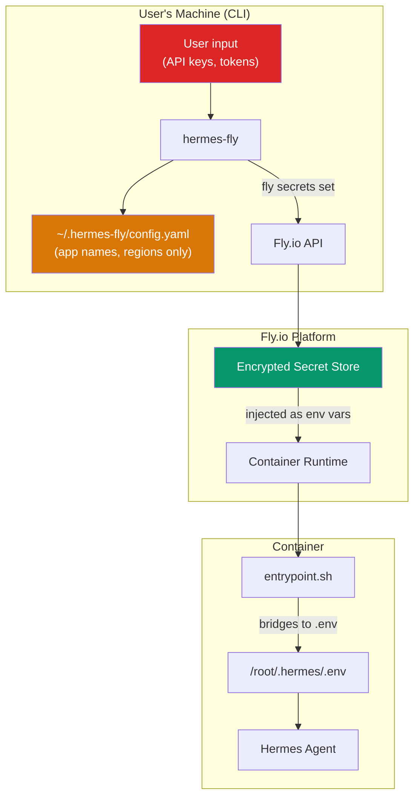

# Security

PSF for secret management, input validation, container isolation, and security boundaries.

**Related PSFs**: [00-architecture](00-hermes-fly-architecture-overview.md) | [07-deployment](07-deployment.md) | [08-maintainability](08-maintainability.md)

## 1. Scope

This document covers the security model of hermes-fly across three domains:

1. **CLI security** — how hermes-fly handles sensitive data locally
2. **Deployment security** — how secrets reach the running container
3. **Container security** — runtime isolation and access control

## 2. Security Architecture



## 3. Secret Management

### 3.1 Principle: Secrets Never Touch Disk Locally

hermes-fly follows a strict rule: **sensitive values are never written to local disk**. They go directly from user input to Fly.io's encrypted secret store via `fly secrets set`.

| Data | Storage location | On local disk? |
|------|-----------------|----------------|
| API keys (OpenRouter, Nous, custom) | Fly.io secrets | Never |
| Bot tokens (Telegram, Discord) | Fly.io secrets | Never |
| LLM model ID | Fly.io secrets | Never |
| App names, regions | `~/.hermes-fly/config.yaml` | Yes (non-sensitive) |
| Deploy timestamps | `~/.hermes-fly/config.yaml` | Yes (non-sensitive) |

### 3.2 Secret Input

API keys and tokens are read via `ui_ask_secret`, which uses `read -rs` (silent mode — no echo to terminal). The value exists only in a Bash variable for the duration of the deploy session, then is passed to `fly secrets set`.

### 3.3 Secret Lifecycle in Container

```text
1. fly secrets set KEY=VAL → stored encrypted by Fly.io
2. Container boots → Fly injects KEY=VAL as environment variable
3. entrypoint.sh bridges env vars → /root/.hermes/.env
4. Hermes Agent reads .env at startup
```

The entrypoint bridges these Fly secrets on every boot:

```text
OPENROUTER_API_KEY, LLM_MODEL, LLM_BASE_URL, LLM_API_KEY, NOUS_API_KEY,
TELEGRAM_BOT_TOKEN, TELEGRAM_ALLOWED_USERS, DISCORD_BOT_TOKEN, DISCORD_ALLOWED_USERS
```

The bridging uses `sed -i` to remove any existing line for the key, then appends the new value. This ensures fresh secrets override stale values.

### 3.4 What Is NOT in the Config File

The local config file (`~/.hermes-fly/config.yaml`) stores only:

```yaml
current_app: hermes-alex-042
apps:
  - name: hermes-alex-042
    region: iad
    deployed_at: 2025-01-15T10:30:00Z
```

No API keys, tokens, passwords, or any sensitive material.

### 3.5 What Is NOT in Generated Artifacts

The Dockerfile and fly.toml are generated from templates. Neither contains secrets:

- **Dockerfile**: Uses `{{HERMES_VERSION}}` (a git ref like "main") — not sensitive
- **fly.toml**: Uses `{{APP_NAME}}`, `{{REGION}}`, etc. — not sensitive
- **entrypoint.sh**: Static script, no secrets embedded

Secrets are injected at runtime by Fly.io, not baked into the Docker image.

## 4. Input Validation

### 4.1 App Name Validation

`deploy_validate_app_name()` enforces:

- Length: 2-63 characters
- Pattern: `^[a-z][a-z0-9-]*[a-z0-9]$`
- Starts with lowercase letter
- Only lowercase letters, digits, hyphens
- Ends with letter or digit

This prevents injection via app names (no special chars, no path separators).

### 4.2 Config File Validation

`config_get_current_app()` validates stored values:

```bash
if [[ "$value" =~ ^[a-zA-Z0-9._-]+$ ]]; then
  echo "$value"
else
  echo ""  # Return empty for invalid values
fi
```

This prevents a corrupted or tampered config file from injecting malicious values into commands. The same validation applies in `config_list_apps()`.

### 4.3 Token Validation

| Token type | Validation | Policy |
|------------|------------|--------|
| Telegram bot token | `^[0-9]+:[A-Za-z0-9_-]+$` | Warn on invalid, proceed anyway |
| Discord bot token | Non-empty, >= 20 chars | Warn on invalid, proceed anyway |
| User IDs | Comma-separated numeric | Warn on invalid, proceed anyway |

Token validation is advisory (warnings, not blocking) to avoid false negatives when token formats evolve.

### 4.4 API Key Handling

API keys have no format validation — they are treated as opaque strings. The only check is non-empty:

```bash
while [[ -z "$api_key" ]]; do
  ui_ask_secret 'OpenRouter API key (required):' api_key
  if [[ -z "$api_key" ]]; then
    printf 'API key cannot be empty.\n' >&2
  fi
done
```

## 5. Container Security

### 5.1 Image Base

The Dockerfile uses `python:3.11-slim` — a minimal Debian-based image. Only three packages are installed: `git`, `curl`, `xz-utils`.

### 5.2 Fly.io Machine Isolation

Each Hermes deployment runs as a Fly.io Machine with:

- **Hardware isolation**: Fly Machines use Firecracker microVMs
- **Network isolation**: Each app gets its own IPv6 address
- **Single machine**: `min_machines_running = 1`, auto_stop disabled
- **HTTP service**: Port 8080 is the only exposed port (via Fly's proxy)

### 5.3 Volume Mount

The persistent volume mounts at `/root/.hermes`:

```toml
[[mounts]]
  source = "hermes_data"
  destination = "/root/.hermes"
```

This contains Hermes runtime data: sessions, logs, pairing info, cached data. The volume persists across container restarts and redeploys.

### 5.4 Access Control

Access control for the Hermes Agent is enforced by Hermes itself (not by hermes-fly):

- `TELEGRAM_ALLOWED_USERS` — comma-separated Telegram user IDs
- `DISCORD_ALLOWED_USERS` — comma-separated Discord user IDs
- Empty = allow all users (no restriction)

These are set as Fly.io secrets and bridged to `.env` by the entrypoint.

### 5.5 Rate Limiting

The entrypoint clears rate limit entries for already-approved users on every boot. This uses an inline Python script that:

1. Reads `/root/.hermes/pairing/*-approved.json` files
2. Builds set of `platform:userId` pairs
3. Removes matching entries from `_rate_limits.json`

This prevents approved users from being rate-limited after container restarts.

## 6. Fly.io Authentication

### 6.1 Auth Flow

hermes-fly verifies authentication via `fly auth whoami`. If not authenticated:

1. Prints message to run `fly auth login` in another terminal
2. Waits up to 60 seconds for user to press Enter
3. Retries `fly auth whoami`
4. Fails with `EXIT_AUTH` (2) if still not authenticated

hermes-fly never handles Fly.io credentials directly — authentication is managed entirely by flyctl.

### 6.2 Organization Access

`deploy_collect_org()` fetches orgs the user has access to via `fly orgs list --json`. The user can only deploy to organizations they belong to.

## 7. Template Substitution Security

Template substitution uses `sed`:

```bash
sed -e "s|{{PLACEHOLDER}}|${value}|g" "$template" > "$output"
```

The pipe `|` delimiter (instead of `/`) avoids issues with values containing `/`. However, values containing `|` or sed metacharacters could potentially break substitution. In practice:

- App names are validated to contain only `[a-z0-9-]`
- Region codes are selected from a known list
- VM sizes are selected from a known list
- Volume sizes are numeric
- The only user-freetext value (`HERMES_VERSION`) defaults to `"main"`

## 8. Security Boundaries

### 8.1 Trust Boundaries

```text
┌────────────────────────────────────────────┐
│ Trusted: hermes-fly CLI                    │
│ - Source code auditable (pure Bash)        │
│ - No network calls except through flyctl   │
│ - No package dependencies to supply-chain  │
└────────────────────────────────────────────┘
         │
         ▼ (fly secrets set)
┌────────────────────────────────────────────┐
│ Trusted: Fly.io Platform                   │
│ - Encrypted secret storage                 │
│ - Firecracker VM isolation                 │
│ - TLS for all network traffic              │
└────────────────────────────────────────────┘
         │
         ▼ (env var injection)
┌────────────────────────────────────────────┐
│ Semi-trusted: Hermes Agent Container       │
│ - Upstream code (NousResearch)             │
│ - Has access to API keys at runtime        │
│ - Network access to LLM providers          │
└────────────────────────────────────────────┘
         │
         ▼ (messaging APIs)
┌────────────────────────────────────────────┐
│ Untrusted: External Users                  │
│ - Interact via Telegram/Discord            │
│ - Filtered by ALLOWED_USERS lists          │
│ - Rate-limited by Hermes Agent             │
└────────────────────────────────────────────┘
```

### 8.2 What hermes-fly Does NOT Protect Against

- **Compromised Hermes Agent**: hermes-fly installs upstream Hermes code. If the upstream is compromised, the deployed container is compromised.
- **Fly.io platform vulnerabilities**: hermes-fly trusts Fly.io for isolation and secret storage.
- **API key leakage via Hermes**: Once API keys are in the container, Hermes Agent has full access. If Hermes has a vulnerability, keys could be exposed.
- **Empty ALLOWED_USERS**: If no user IDs are configured, anyone can interact with the bot.

## 9. Installer Security

The `scripts/install.sh` is designed for `curl | bash` installation:

```bash
curl -fsSL https://get.hermes-fly.dev/install.sh | bash
```

This follows common CLI distribution patterns but carries the standard `curl | bash` risks. The alternative is cloning the repository directly:

```bash
git clone https://github.com/alexfazio/hermes-fly.git
```

## 10. Security Checklist for Contributors

When adding new features:

- [ ] Never write secrets to disk (local files, logs, temp files)
- [ ] Never echo secrets to stdout/stderr (use `ui_ask_secret` for input)
- [ ] Validate all user input before using in commands
- [ ] Use Fly.io secrets for all sensitive values
- [ ] Don't embed secrets in Docker images or config files
- [ ] Add input validation for any new user-facing parameters
- [ ] Test with `HERMES_FLY_CONFIG_DIR` isolation to avoid touching real config
