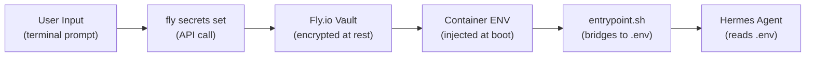
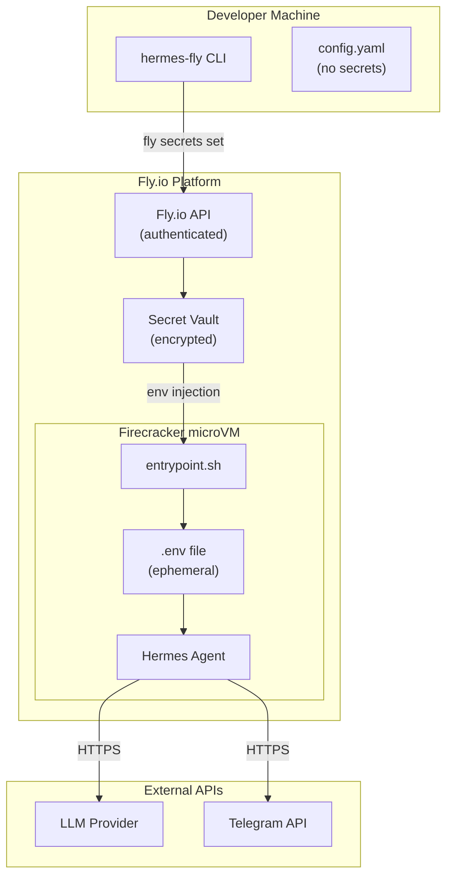

# Security

PSF for secret management, container isolation, input validation, and security boundaries.

**Related PSFs**: [00-architecture](00-hermes-fly-architecture-overview.md) | [07-deployment](07-deployment.md) | [08-maintainability](08-maintainability.md)

## 1. TL;DR

- **Core principle**: secrets never touch local disk — user input → `fly secrets set` directly
- **Config file** (`~/.hermes-fly/config.yaml`): only app names, regions, timestamps
- **Container isolation**: Fly.io Firecracker microVMs, one machine per app
- **Secret bridging**: `entrypoint.sh` bridges Fly secrets to container env on every boot
- **Type safety**: TypeScript strict mode + immutable domain entities prevent state corruption

## 2. Secret Management

### Secret Flow

### What's a Secret
| Secret | Source | Storage |
|--------|--------|---------|
| LLM API key (OpenRouter/OpenAI/etc.) | User prompt during deploy | Fly.io vault only |
| Telegram bot token | User prompt during deploy | Fly.io vault only |
| Telegram chat ID | User prompt during deploy | Fly.io vault only |
| Discord webhook URL | Legacy (no longer collected) | Fly.io vault (if previously set) |

### What's NOT a Secret
Stored in `~/.hermes-fly/config.yaml`:
- App names, regions, timestamps, platform info
- `current_app` pointer
- No API keys, tokens, or credentials ever written to config

### Entrypoint Secret Bridging

`templates/entrypoint.sh` (105 lines) on every container boot:
1. Reads Fly-injected environment variables
2. Writes them to `/root/.hermes/.env` inside the container
3. Configures Telegram bot settings
4. Seeds skills directory
5. Starts Hermes Agent

This bridging happens on every boot to ensure secrets are never stale and the `.env` file is ephemeral to the container lifecycle.

## 3. Container Isolation

### Fly.io Security Model
| Layer | Protection |
|-------|-----------|
| **Firecracker microVM** | Hardware-level isolation per app |
| **Single machine** | One machine per app (`min_machines_running = 1`) |
| **Base image** | `python:3.11-slim` with minimal packages (git, curl, xz-utils) |
| **No SSH by default** | SSH access only via `fly ssh console` (authenticated) |
| **Volume isolation** | Persistent volume mounted only to its app's machine |

### Network Boundaries
- Outbound: HTTPS to LLM API endpoints, Telegram API
- Inbound: Fly.io gateway proxy (HTTPS termination)
- No inter-app communication

## 4. Input Validation

### TypeScript Layer
- **Domain entities**: `DeploymentIntent.create()` validates all fields (non-empty, correct format)
- **App name validation**: enforced at the Fly.io API level (alphanumeric + hyphens)
- **Channel validation**: must be `stable`, `preview`, or `edge`
- **Strict typing**: TypeScript `strict: true` prevents null/undefined misuse

### CLI Layer
- **Commander.js**: validates known options, rejects unknown commands
- **Arg parsing**: manual parsing in command modules with explicit null handling
- **Exit codes**: typed returns (0, 1, 4) — no uncaught exceptions in normal flow

### Template Layer
- **sed substitution**: values inserted into templates are from validated domain entities
- **No shell injection**: template values are app names and config strings (validated upstream)

## 5. Security Boundaries Diagram

## 6. TypeScript Security Improvements

The TypeScript transition brought several security improvements over the bash implementation:

| Improvement | Mechanism |
|-------------|-----------|
| **Immutable domain entities** | Factory methods with validation; no mutation after creation |
| **Type-safe exit codes** | Typed return values prevent accidental code misuse |
| **Port isolation** | Infrastructure details hidden behind interfaces |
| **No eval/exec** | No dynamic code execution (unlike bash's `eval`) |
| **ProcessRunner containment** | `node:child_process` imports restricted to 2 files |
| **Strict null checks** | TypeScript strict mode catches null/undefined errors at compile time |

## 7. Threat Considerations

| Threat | Mitigation | Residual Risk |
|--------|-----------|---------------|
| Secret leakage to disk | Secrets flow directly to Fly.io vault | Container .env is ephemeral but exists at runtime |
| Config file exposure | No secrets in config.yaml | App names visible (low sensitivity) |
| Template injection | Validated domain entities as input | sed substitution could be fragile with special chars |
| Fly CLI token theft | Token managed by flyctl, not hermes-fly | User's flyctl auth is a trust boundary |
| Dependency supply chain | Only 1 runtime dep (commander) | Dev deps (typescript, tsx, dep-cruiser) are build-time only |

## 8. Discord Legacy

Discord setup wizard was removed in v0.1.14 (Telegram-only). However:
- Discord webhook secret is still **bridged** in `entrypoint.sh` for backward compatibility
- Existing deployments with Discord configured continue to work
- No new Discord configurations can be created through the CLI
